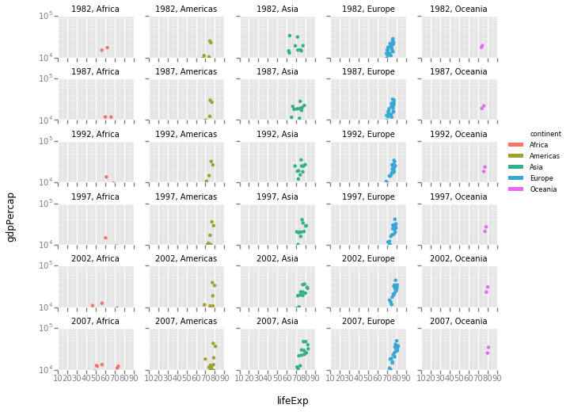
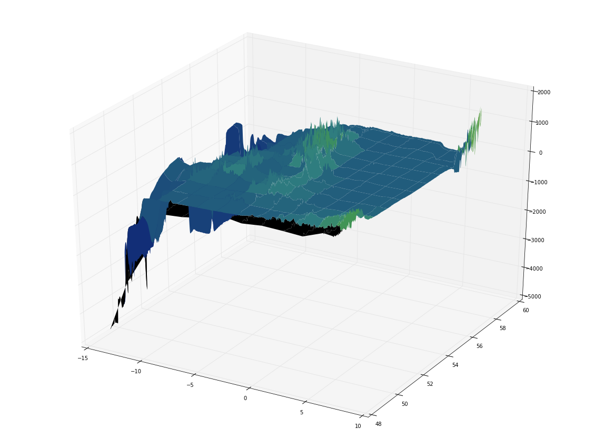
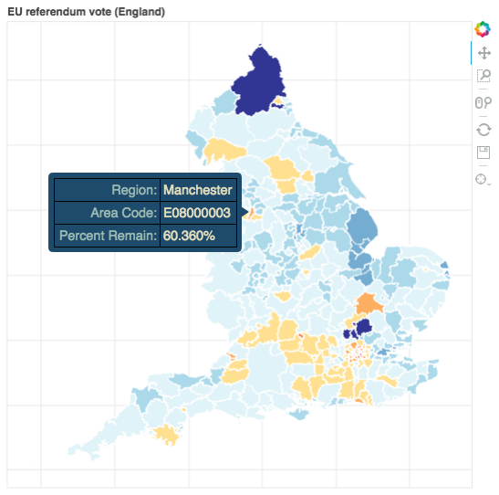

# README.md - 2016-07-28_manchester_datavis

This repository contains files for the Python hands-on session of the [Software Sustainability Institute](http://software.ac.uk/) Research Data Visualisation Workshop (RDVW) at the University of Manchester, 28th July 2016.

* Course website: [http://software.ac.uk/rdvw](http://software.ac.uk/rdvw)
* Course registration: [Eventbrite](http://www.eventbrite.com/e/research-data-visualisation-workshop-rdvw-tickets-25927808774?aff=SSILandingPage)

## Run this workshop in your browser

These workshop materials are designed to be compatible with [MyBinder](mybinder.org). To start an instance of this repository, click on the badge below:

## Acknowledgements

These exercises borrow heavily and adapt or use material from several excellent sources, including:

* Data Carpentry: [http://www.datacarpentry.org/](http://www.datacarpentry.org/)
* Software Carpentry: [http://software-carpentry.org/](http://software-carpentry.org/) - especially the R novice Gapfinder material
* `ggplot2: Elegant Graphics for Data Analysis`: [http://www.springer.com/us/book/9780387981413](http://www.springer.com/us/book/9780387981413)
* `bokeh` documentation: [http://bokeh.pydata.org/en/latest/docs/gallery.html#gallery](http://bokeh.pydata.org/en/latest/docs/gallery.html#gallery)

If you recognise some of this content and are not acknowledged here, please let me know and I will correct that! I don't think I'm in breach of any copyright or licensing, but if you notice any such breaches please let me know and I will rectify as soon as is possible.

## Exercises

### Grammar of Graphics

* [grammar_of_graphics.ipynb](exercises/grammar_of_graphics/grammar_of_graphics.ipynb)

#### Learning Outcomes

* Understand the Grammar of Graphics
* Use the Grammar of Graphics with the `ggplot` module to produce plots from *aesthetics* and *geometric representations*.
* Use *layers* to produce new visualisations specifically to suit your data, showing data and statistical summaries
* Use multi-panel figures to display complex datasets

### Imaging 2D arrays, colormaps, and 3D surface plots

* [colormaps_surfaces_netcdf.ipynb](exercises/colormaps_surfaces_netcdf/colormaps_surfaces_netcdf.ipynb)

#### Learning Outcomes

* Read and use NetCDF format data using Python
* Visualise array data as a heatmap/image
* Explore array data visualisation with a range of colour palettes, and understand how selection and normalisation of colour palettes can influence the interpretation of data
* Visualise 2D array data as a 3D surface plot
* Explore the application and influence of colour palettes and lighting effects on the interpretation of 3D surface plots

### Interactive map with `bokeh`

* [interactive_bokeh_map.ipynb](exercises/interactive_bokeh_map/interactive_bokeh_map.ipynb)

### Learning Outcomes

* Import and process shapefile GIS data using `pyshp`
* Import public `.csv` (electoral) data using `pandas`
* Render GIS boundary data in an interactive `bokeh` plot
* Colour geospatial data by results in an interactive `bokeh` plot

