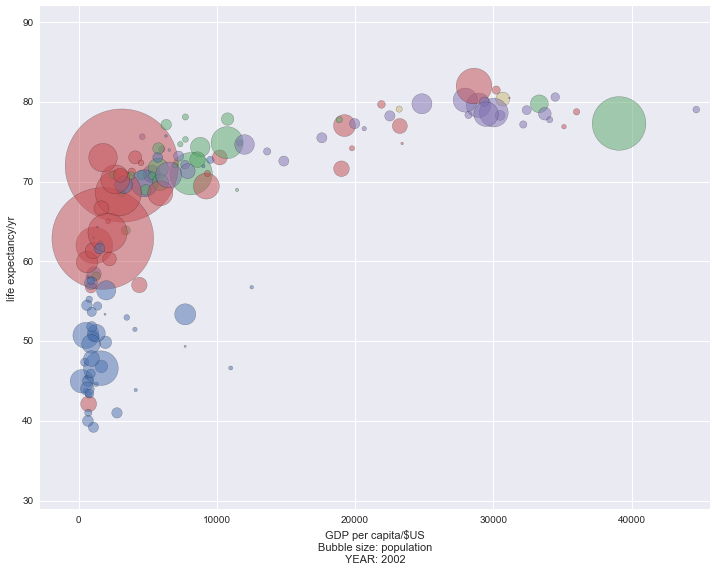

# README.md - 2016-07-28_manchester_datavis

This repository contains files for the Python hands-on session of the [Software Sustainability Institute](http://software.ac.uk/) Research Data Visualisation Workshop (RDVW) at the University of Manchester, 28th July 2016.

* Course website: [http://software.ac.uk/rdvw](http://software.ac.uk/rdvw)
* Course registration: [Eventbrite](http://www.eventbrite.com/e/research-data-visualisation-workshop-rdvw-tickets-25927808774?aff=SSILandingPage)
* Workshop report: [SSI blog post](https://www.software.ac.uk/blog/2016-08-17-research-data-visualisation-workshop-report)
* Videos of workshop keynotes: [YouTube](https://www.youtube.com/playlist?list=PLpX1jXuNTXGrjl6CxJ6Cly1GKO1su9yeD)
* Speaker slides: [Google Drive](https://drive.google.com/drive/u/0/folders/0B7Jaz2j9AIcWbkRoYy1Ib0ZULWs)
* Storify of tweets: [Storify](https://storify.com/SoftwareSaved/research-data-visualisation-workshop)

## Running this workshop in your browser

These workshop materials are designed to be compatible with [MyBinder](mybinder.org). To start an instance of this repository, click on the badge below:

## Acknowledgements

These exercises borrow heavily and adapt or use material from several excellent sources, including:

* Data Carpentry: [http://www.datacarpentry.org/](http://www.datacarpentry.org/)
* Software Carpentry: [http://software-carpentry.org/](http://software-carpentry.org/) - especially the R novice Gapfinder material
* `ggplot2: Elegant Graphics for Data Analysis`: [http://www.springer.com/us/book/9780387981413](http://www.springer.com/us/book/9780387981413)
* `bokeh` documentation: [http://bokeh.pydata.org/en/latest/docs/gallery.html#gallery](http://bokeh.pydata.org/en/latest/docs/gallery.html#gallery)
* "39 studies about human data perception in 30 minues", Kennedy Elliott: [link](https://medium.com/@kennelliott/39-studies-about-human-perception-in-30-minutes-4728f9e31a73#.wgrldy54e)
* The Data Visualisation Catalogue: [http://www.datavizcatalogue.com](http://www.datavizcatalogue.com/index.html)

If you recognise some of this content and are not acknowledged here, please let me know and I will correct that! I don't think I'm in breach of any copyright or licensing, but if you notice any such breaches please let me know and I will rectify as soon as is possible.

## Exercises

### One-variable, continuous data

* [one_variable_continuous.ipynb](exercises/one_variable_continuous/one_variable_continuous.ipynb)

#### Learning Outcomes

* Generating randomly-distributed example data
* Representing one-dimensional continuous-valued data with histograms, KDE plots, and rug plots
* Using `matplotlib` and `seaborn` libraries
* Presenting arrays of images
* Use of `figure()` and `subplots()`

### Two-variable, continuous *x*, *y* data

* [continuous_x_continuous_y.ipynb](exercises/two_variables/continuous_x_continuous_y.ipynb)

### Learning Outcomes

* Representing two-dimensional continuous *x* and *y* data using `matplotlib` and `seaborn` libraries
* Use of `figure()` and subplots
* Annotating plots with text
* Working with long and wide form `DataFrame`s in `pandas`
* Using statistical overlays and `seaborn`'s statistical plots

### Grammar of Graphics

* [grammar_of_graphics.ipynb](exercises/grammar_of_graphics/grammar_of_graphics.ipynb)

#### Learning Outcomes

* Understand the Grammar of Graphics
* Use the Grammar of Graphics with the `ggplot` module to produce plots from *aesthetics* and *geometric representations*.
* Use *layers* to produce new visualisations specifically to suit your data, showing data and statistical summaries
* Use multi-panel figures to display complex datasets

### Imaging 2D arrays, colormaps, and 3D surface plots

* [colormaps_surfaces_netcdf.ipynb](exercises/colormaps_surfaces_netcdf/colormaps_surfaces_netcdf.ipynb)

#### Learning Outcomes

* Read and use NetCDF format data using Python
* Visualise array data as a heatmap/image
* Explore array data visualisation with a range of colour palettes, and understand how selection and normalisation of colour palettes can influence the interpretation of data
* Visualise 2D array data as a 3D surface plot
* Explore the application and influence of colour palettes and lighting effects on the interpretation of 3D surface plots

### Interactive map with `bokeh`

* [interactive_bokeh_map.ipynb](exercises/interactive_bokeh_map/interactive_bokeh_map.ipynb)

### Learning Outcomes

* Import and process shapefile GIS data using `pyshp`
* Import public `.csv` (electoral) data using `pandas`
* Render GIS boundary data in an interactive `bokeh` plot
* Colour geospatial data by results in an interactive `bokeh` plot

### Making movies with `matplotlib` and `seaborn`

* [making_movies.ipynb](exercises/making_movies/making_movies.ipynb)

### Learning Outcomes

* Understand `matplotlib`'s `animation` functionality
* Generate animations using `FuncAnimation`
* Generate line graph and bubble plot animations

